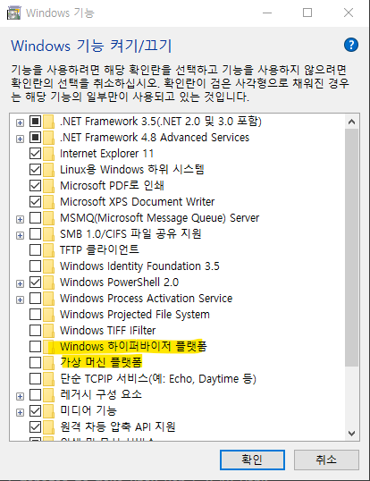

# Docker와 Virtual Box를 동시에 사용하기

> VirtualBox 6
Installing VirtualBox 6 is simple and you can find the install on the VirtualBox download page. It can be a little tricky to get some VMs running now that you have Hyper‑V enabled. For me, when I tried to restart an old VM, or create a new one using the defaults, I would get an error right away.
>
> Alert window showing Virtual Box error message: "Failed to open a session for the virtual machine hypertest."
>
>To get your VMs working, you will need to go into the VM settings, choose the System section, go into the Acceleration tab, and select Hyper‑V as the Paravirtualization Interface. You may also have to disable the I/O APC checkbox on the Motherboard tab. I’ve found some guest OS crash with it checked, but if it works for you, then leave it as is. THEN, you need to add an obscure setting to the .vbox file associated with your VM image:
>
>`VBoxManage setextradata "<VM Name>" "VBoxInternal/NEM/UseRing0Runloop" 0`<br>
I found that tip about the UseRing0Runloop setting on a forum posting that I was lucky enough to stumble upon.

```
I managed to make Vbox ver 6.0.10 work on Win1903 build 18362.239 with hyper-v enabled.

In your .vbox file locate <ExtraData> section and add the following line:

<ExtraDataItem name="VBoxInternal/NEM/UseRing0Runloop" value="0"/>
```

## 위 방법이 안될 시
> `Window 키 + S --> 'Windows 기능 켜기/끄기' --> 'Hyper-V' 기능 또는 'Windows 하이퍼바이저 플랫폼'과 '가상머신 플랫폼'` 기능 해제 및 윈도우 재시작<br>


> * 기본적으로 `WSL2`와 `VMWare` 또는 `Virtualbox`는 호환이 되지 않는다. 그렇기에 `WSL2`가 설치된 필자의 PC에서는 `WSL2`와 `Virtualbox`가 동시에 실행되지 않았던것.. (`Hyper-v`를 기본적으로 사용하는 `Docker`도 마찬가지)

# Links
* [Yes, You Can Run Docker AND Virtualbox on Windows 10 Home](https://www.tcg.com/blog/yes-you-can-run-docker-and-virtualbox-on-windows-10-home/)
* [Virtualbox Forum](https://forums.virtualbox.org/viewtopic.php?t=90853&start=120)